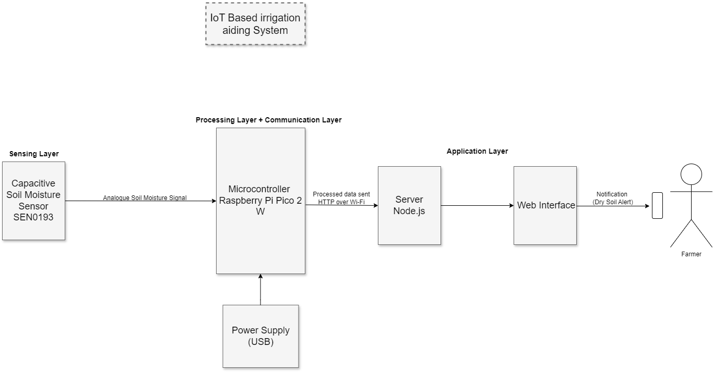

# Wispour
### IoT Irrigation Aiding System

Wispour is a final year project focused on designing an IoT-based irrigation aiding
system to optimize water usage through sensor-based monitoring and automated control.

## Objectives
- Study existing smart irrigation systems
- Design an efficient IoT-based irrigation architecture
- Develop a methodology for data collection and decision-making

## Features
- Soil moisture monitoring
- Averaged sensor readings for stability
- Dry/Wet state detection
- Wi-Fi data transmission
- Web-based user interface

## System Architecture

## Hardware Components
- Capacitive Soil Moisture Sensor (DFRobot SEN0193)
- Raspberry Pi Pico 2 W
- USB Power Supply

## How It Works
1. Sensor reads soil moisture (analogue signal)
2. Microcontroller converts to digital (ADC)
3. Multiple readings are sampled and averaged
4. Average is compared to a threshold
5. State (DRY/WET) is determined
6. Data is sent to server
7. User is notified via interface

## Setup
1. Connect sensor to microcontroller
2. Upload MicroPython code
3. Connect to Wi-Fi
4. Run server
5. Access web interface

## Current Status
- Literature review in progress
- Methodology design upcoming
- Implementation phase pending
